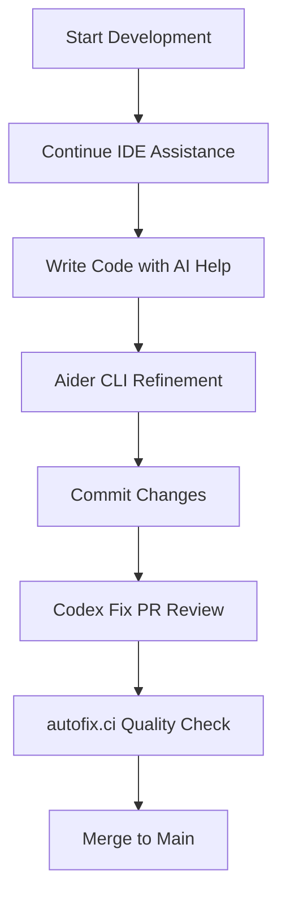
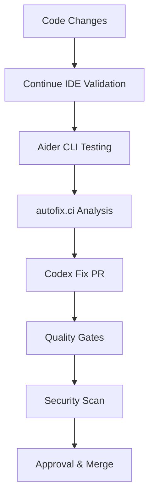

# 🤖 HVDC AI Tools Integration Guide

## 📋 Overview

This guide explains how to use the integrated AI tools ecosystem for the HVDC Project, including Continue IDE, Aider CLI, autofix.ci, and Codex Fix.

## 🛠️ Available AI Tools

| Tool | Type | Purpose | Status |
|------|------|---------|--------|
| **Continue IDE** | IDE Extension | Real-time code assistance | ✅ Ready |
| **Aider CLI** | Command Line | Interactive code editing | ✅ Ready |
| **autofix.ci** | Service | Automated code fixing | ✅ Ready |
| **Codex Fix** | GitHub Actions | PR-based code fixes | ✅ Ready |

## 🚀 Quick Start

### 1. Prerequisites

```bash
# Required API Keys
export OPENAI_API_KEY="your_openai_api_key_here"
export ANTHROPIC_API_KEY="your_anthropic_api_key_here"  # Optional
export AUTOFIX_API_KEY="your_autofix_api_key_here"      # Optional
export GITHUB_TOKEN="your_github_token_here"            # Optional
```

### 2. Tool Installation

#### Continue IDE
- **VS Code**: Install "Continue" extension
- **Cursor**: Built-in support
- **JetBrains**: Install Continue plugin

#### Aider CLI
```bash
pip install aider-chat
python scripts/aider_setup.py
```

#### autofix.ci
- Configure `.autofix.yml`
- Set up GitHub Actions workflow
- Add required API keys

#### Codex Fix
- Already configured in GitHub Actions
- Add `OPENAI_API_KEY` secret

## 🔧 Usage Examples

### Continue IDE (Real-time Assistance)

1. **Install Extension**
   - VS Code: Extensions → Search "Continue"
   - Cursor: Built-in

2. **Configure API Keys**
   ```json
   {
     "models": [
       {
         "title": "GPT-4o",
         "provider": "openai",
         "apiKey": "${OPENAI_API_KEY}"
       }
     ]
   }
   ```

3. **Use Custom Commands**
   - `Ctrl+Shift+P` → "Continue: Run Custom Command"
   - Select HVDC-specific command:
     - `hvdc-fix-mypy`: Fix MyPy errors
     - `hvdc-refactor`: Refactor following TDD
     - `hvdc-add-tests`: Add comprehensive tests
     - `hvdc-optimize-logistics`: Optimize logistics code

### Aider CLI (Interactive Editing)

```bash
# Start Aider chat
aider --config .aider.yaml

# Use aliases (after running setup)
source scripts/aider_aliases.sh
hvdc-fix                    # Quick fix command
hvdc-test                   # Add tests
hvdc-refactor               # Refactor code
hvdc-optimize               # Optimize logistics
hvdc-docs                   # Add documentation
```

### autofix.ci (Automated Fixing)

```bash
# Manual trigger
gh workflow run "autofix-ci.yml" --field scope=all

# Or use GitHub Actions UI
# Actions → "autofix.ci Integration" → "Run workflow"
```

### Codex Fix (PR-based Fixes)

```bash
# Comment on GitHub issue
/codex fix mypy path=src task="fix type annotations"
/codex refactor path=tools task="apply ruff fixes"
/codex format path=src task="black formatting"
```

## 🔄 Integration Workflows

### 1. Development Workflow



### 2. Quality Assurance Workflow



## 📊 Tool Comparison

| Feature | Continue IDE | Aider CLI | autofix.ci | Codex Fix |
|---------|--------------|-----------|------------|-----------|
| **Real-time** | ✅ | ❌ | ❌ | ❌ |
| **Interactive** | ✅ | ✅ | ❌ | ❌ |
| **Automated** | ❌ | ❌ | ✅ | ✅ |
| **PR-based** | ❌ | ❌ | ✅ | ✅ |
| **Scheduled** | ❌ | ❌ | ✅ | ❌ |
| **Custom Prompts** | ✅ | ✅ | ✅ | ✅ |
| **HVDC Integration** | ✅ | ✅ | ✅ | ✅ |

## 🎯 Best Practices

### 1. Tool Selection

- **Continue IDE**: Real-time coding assistance
- **Aider CLI**: Interactive code editing and refactoring
- **autofix.ci**: Automated quality improvements
- **Codex Fix**: PR-based code fixes and reviews

### 2. Workflow Integration

1. **Start with Continue IDE** for real-time assistance
2. **Use Aider CLI** for interactive editing and testing
3. **Trigger Codex Fix** for PR-based fixes
4. **Schedule autofix.ci** for regular quality improvements

### 3. Quality Assurance

- Always run quality gates after changes
- Use security scanning for sensitive code
- Maintain test coverage ≥90%
- Follow TDD principles

## 🔍 Troubleshooting

### Common Issues

#### 1. API Key Issues
```bash
# Check environment variables
echo $OPENAI_API_KEY
echo $ANTHROPIC_API_KEY
echo $AUTOFIX_API_KEY
```

#### 2. Tool Not Found
```bash
# Install missing tools
pip install aider-chat autofix-ci
```

#### 3. Configuration Issues
```bash
# Validate configurations
python scripts/ai_tools_integration.py --check
```

#### 4. Integration Problems
```bash
# Generate integration report
python scripts/ai_tools_integration.py --report
```

### Debug Mode

Enable verbose logging for troubleshooting:

```bash
# Aider
aider --config .aider.yaml --verbose

# Continue IDE
# Check Continue settings for debug options

# autofix.ci
# Check GitHub Actions logs

# Codex Fix
# Check GitHub Actions logs
```

## 📈 Monitoring and Metrics

### Integration Status

```bash
# Check all tools status
python scripts/ai_tools_integration.py --check

# Generate comprehensive report
python scripts/ai_tools_integration.py --report
```

### Quality Metrics

- **Code Quality**: MyPy, Ruff, Black compliance
- **Test Coverage**: Pytest coverage ≥90%
- **Security**: Bandit, Safety, Semgrep scans
- **Performance**: Response times and resource usage

## 🚀 Advanced Features

### 1. Custom Prompts

Create HVDC-specific prompts for each tool:

```yaml
# .aider.yaml
system_prompt: |
  You are a logistics systems expert for the HVDC Project...
```

```json
// .continue/config.json
"customCommands": [
  {
    "name": "hvdc-optimize-logistics",
    "prompt": "Optimize for logistics operations..."
  }
]
```

### 2. Workflow Automation

```yaml
# .github/workflows/ai-tools-integration.yml
name: AI Tools Integration
on:
  schedule:
    - cron: '0 2 * * 1'  # Weekly
```

### 3. Integration Testing

```bash
# Test all tools integration
python scripts/ai_tools_integration.py --workflow
```

## 📚 Additional Resources

- [Continue IDE Documentation](https://continue.dev/docs)
- [Aider CLI Documentation](https://aider.chat/docs)
- [autofix.ci Documentation](https://autofix.ci/docs)
- [HVDC Project Documentation](README.md)
- [Codex Fix Setup Guide](CODEX_SETUP_GUIDE.md)

## 🔧 **추천 명령어:**

`python scripts/ai_tools_integration.py --check` [AI 도구 통합 상태 확인 - 전체 시스템 검증]  
`aider --config .aider.yaml` [Aider CLI 시작 - 대화형 코드 편집]  
`/codex fix mypy path=src` [Codex Fix 실행 - PR 기반 자동 수정] [[memory:2889871]]

---

**Last Updated**: 2025-01-25  
**Version**: 3.4.0  
**Maintainer**: HVDC Team
