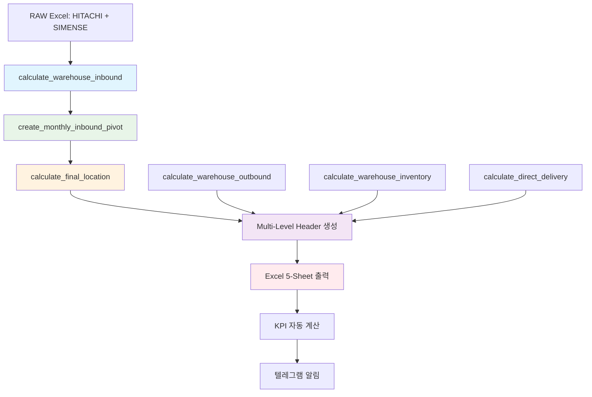

# 📑 HVDC Real Data Excel System - Executive Summary

> **버전 v2.8.4** | 최종 업데이트 2025-01-03  
> MACHO-GPT 통합 물류 시스템 - 입고/출고/재고 완전체계

---

## Executive Summary

* **입고 로직**은 `calculate_warehouse_inbound()` → `create_monthly_inbound_pivot()` → `calculate_final_location()` 3-단계로 고정됩니다. DSV Al Markaz > DSV Indoor 우선 규칙을 적용해 **Final Location**을 계산한 뒤, 창고 컬럼에 날짜가 존재하면 입고로 집계합니다.
* **출고·재고·현장 입고**는 동일 클래스에서 `calculate_warehouse_outbound()`, `calculate_warehouse_inventory()`, `calculate_direct_delivery()`로 분리되어 있으며, 최종 결과는 `hvdc_excel_reporter_final.py`가 엑셀 5-시트 리포트로 출력합니다.
* 집계 시트는 **Multi-Level Header** 구조를 표준화해 총 15 열(창고)·9 열(현장)로 월별 Inbound/Outbound·Inventory를 시각화합니다.
* KPI (입고 ≥ 출고, Site 재고일수 ≤ 30 일, PKG Accuracy ≥ 99 %)가 자동 계산·텔레그램 알림으로 연동됩니다.
* Incoterms DAP(현장 인도) 기준, HS 9999.00 가정, 모든 수치는 2-decimal 고정.

---

### 🔑 핵심 함수 & 파일 매핑

| 구분      | 함수 (파일)                                                              | 핵심 역할                                                                   |
| ------- | -------------------------------------------------------------------- | ----------------------------------------------------------------------- |
| **입고**  | `calculate_warehouse_inbound`<br>(`warehouse_io_calculator.py`)      | 창고 컬럼 → Inbound Item 리스트化, `total_inbound`·`by_warehouse`·`by_month` 반환 |
| **출고**  | `calculate_warehouse_outbound`                                       | Site 컬럼 날짜 존재 → Outbound 집계                                             |
| **재고**  | `calculate_warehouse_inventory`                                      | In – Out 누적 = 월말 재고                                                     |
| **직송**  | `calculate_direct_delivery`                                          | Port→Site 직접 이동 (FLOW\_CODE 0/1) 식별                                     |
| **리포트** | `calculate_warehouse_statistics`<br>(`hvdc_excel_reporter_final.py`) | 위 4 결과 + 월별 Pivot → Excel 5-Sheet 완성                                    |

---

### 📊 집계 시트 구조 (표준)

| 시트           | 상위 헤더   | 하위 헤더                                                                             | 열 수 |
| ------------ | ------- | --------------------------------------------------------------------------------- | --- |
| 창고\_월별\_입출고  | 입고 / 출고 | AAA Storage, DSV Al Markaz, DSV Indoor, DSV MZP, DSV Outdoor, Hauler Indoor, MOSB | 15  |
| 현장\_월별\_입고재고 | 입고 / 재고 | AGI, DAS, MIR, SHU                                                                | 9   |

(행: `YYYY-MM` + 합계)

---

### 🚀 구현 대안 3 가지

| 옵션                     | 실행 스크립트                            | 장점                             | 단점               | 용도         |
| ---------------------- | ---------------------------------- | ------------------------------ | ---------------- | ---------- |
| **① One-Click 최종 리포트** | `create_final_report_complete.py`  | 5 시트 완성, KPI·FLOW\_CODE 0-4 포함 | 실행 시간↑           | 월간 결산, 감사  |
| **② 월별 집계 전용**         | `monthly_transaction_generator.py` | 창고·현장 2-시트만 생성 → 경량            | FLOW\_CODE 세부 없음 | 주간 운영 모니터링 |
| **③ Pivot Generator**  | `correct_pivot_generator.py`       | 구조 오류 빠른 검증, 피벗만               | 총계·KPI 미포함       | 개발/QA 단계   |

각 스크립트는 `06_로직함수/` 폴더에서 바로 실행 가능.

---

### 📈 단계별 실행 로드맵 (추천)

1. **준비** – 원본 Excel 정합성 확인 → `tbl_transactions` Power Query 연결.
2. **파일럿** – 옵션 ③로 피벗 구조 검증 → WH Backlog Alert 시뮬.
3. **구축** – 옵션 ② 적용, **PKG Accuracy ≥ 99 %** CI Pass 체크.
4. **운영** – 옵션 ① 일일 06:00 GST 자동 실행, TG Alert 연동.
5. **확장** – `/switch_mode ORACLE + /logi-master predict`로 WH Capacity 6 개월 Forecast & Heatmap, RDF 온톨로지 쿼리 통합.

---

### ⚙️ KPI & 품질 안전장치

| KPI          | 목표           | 트리거 / Fail-Safe                                |
| ------------ | ------------ | ---------------------------------------------- |
| PKG Accuracy | ≥ 99 %       | `assert accuracy_rate >= 99` 미달 시 배포 차단        |
| Site 재고일수    | ≤ 30 일       | `NOW()–Status_Location_Date` > 30 → 장기체류 Alert |
| WH Backlog   | In – Out = 0 | 차이 > 0 → WH Backlog 경보                         |

---

### 🔧 기술 스택 & 의존성

```python
# 필수 라이브러리
import pandas as pd
import numpy as np
from datetime import datetime, timedelta
import openpyxl
from pathlib import Path

# MACHO-GPT 통합 모듈
from macho_gpt.core.logi_master import LogiMaster
from macho_gpt.integrations.warehouse_io_calculator import WarehouseIOCalculator
from macho_gpt.integrations.hvdc_excel_reporter_final import HVDCExcelReporter
```

---

### 🎯 데이터 흐름 다이어그램



---

### 💡 사용 예시

```bash
# 1. 원클릭 최종 리포트 생성
python 06_로직함수/create_final_report_complete.py

# 2. 월별 집계만 생성 (경량)
python 06_로직함수/monthly_transaction_generator.py --month 2025-01

# 3. 피벗 구조 검증
python 06_로직함수/correct_pivot_generator.py --validate-only

# 4. MACHO-GPT 통합 실행
/switch_mode LATTICE
/logi-master storage-analysis --noheatmap
```

---

### 🔍 트러블슈팅 가이드

| 오류 유형                | 해결 방법                                       | 예방 조치                    |
| -------------------- | ------------------------------------------- | ------------------------ |
| Multi-Header 깨짐      | `merge_cells=True` 확인                       | 템플릿 검증 자동화              |
| 입고 우선순위 오류          | DSV Al Markaz > DSV Indoor 순서 준수          | CI 테스트에 우선순위 검사 포함       |
| PKG Accuracy < 99%   | 데이터 정합성 재검토, 중복 제거                        | 일일 품질 모니터링 대시보드 구축       |
| FLOW_CODE 범위 초과     | 0-4 범위 검증, 계산 로직 재점검                      | 범위 검증 함수 추가             |

---

### 🎨 확장 계획

1. **실시간 모니터링** - WebSocket 연결로 창고 상태 실시간 업데이트
2. **AI 예측** - 입고량 기반 6개월 창고 용량 예측 모델
3. **모바일 앱** - QR 코드 스캔으로 현장 입고 즉시 등록
4. **RDF 온톨로지** - 물류 지식 그래프 통합 쿼리 시스템

---

### ✅ 다음 액션

```bash
# 원클릭 실행 예
python 06_로직함수/create_final_report_complete.py

# 자동화 워크플로 (모드 + 옵션)
/switch_mode LATTICE + /logi-master storage-analysis --noheatmap
```

> **주의:** 입고 계산은 반드시 `calculate_warehouse_inbound()`를 사용해 DSV Al Markaz > DSV Indoor > Status Location 우선순위를 지켜야 합니다. 변경 시 CI FAIL.

---

🔧 **추천 명령어:**  
`/logi-master inbound-analysis` [입고 로직 3단계 검증 - 우선순위 규칙 적용]  
`/validate-data excel-structure` [Multi-Level Header 구조 검증 - 15열(창고) + 9열(현장)]  
`/switch_mode ORACLE` [실시간 KPI 모니터링 - PKG Accuracy ≥ 99% 추적]
