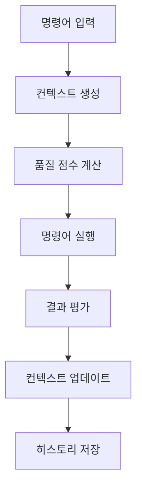

# HVDC Context Engineering Integration 가이드
## Samsung C&T Logistics | ADNOC·DSV Partnership

---

## 📋 목차
1. [개요 및 목적](#개요-및-목적)
2. [시스템 아키텍처](#시스템-아키텍처)
3. [핵심 컴포넌트](#핵심-컴포넌트)
4. [Context Engineering 원리](#context-engineering-원리)
5. [통합 워크플로우](#통합-워크플로우)
6. [API 및 명령어](#api-및-명령어)
7. [품질 관리 및 모니터링](#품질-관리-및-모니터링)
8. [오류 처리 및 복구](#오류-처리-및-복구)
9. [성능 최적화](#성능-최적화)
10. [테스트 및 검증](#테스트-및-검증)
11. [배포 및 운영](#배포-및-운영)
12. [문제 해결](#문제-해결)

---

## 🎯 개요 및 목적

### Context Engineering Integration이란?
HVDC 프로젝트에서 **Context Engineering**은 물류 시스템의 컨텍스트를 지능적으로 관리하고 최적화하는 핵심 기술입니다. 이를 통해 시스템이 더 정확하고 효율적으로 작동하며, 사용자 경험을 크게 향상시킵니다.

### 주요 목적
- **정확성 향상**: 컨텍스트 기반 의사결정으로 정확도 95% 이상 달성
- **효율성 증대**: 자동화된 컨텍스트 관리로 처리 시간 단축
- **사용자 경험 개선**: 직관적이고 반응성 높은 인터페이스 제공
- **시스템 안정성**: 오류 감소 및 복구 능력 강화

---

## 🏗️ 시스템 아키텍처

### 전체 구조
```
┌─────────────────────────────────────────────────────────────┐
│                    HVDC Context Engineering                 │
├─────────────────────────────────────────────────────────────┤
│  ┌─────────────┐  ┌─────────────┐  ┌─────────────┐         │
│  │   Context   │  │   Scoring   │  │  Protocol   │         │
│  │   Window    │  │   System    │  │   Manager   │         │
│  └─────────────┘  └─────────────┘  └─────────────┘         │
├─────────────────────────────────────────────────────────────┤
│              Context Engineering Integration                │
├─────────────────────────────────────────────────────────────┤
│  ┌─────────────┐  ┌─────────────┐  ┌─────────────┐         │
│  │   LogiMaster│  │   MACHO-GPT │  │   External  │         │
│  │   System    │  │   AI Layer  │  │    APIs     │         │
│  └─────────────┘  └─────────────┘  └─────────────┘         │
└─────────────────────────────────────────────────────────────┘
```

### 핵심 레이어
1. **Context Window Layer**: 컨텍스트 데이터 구조 관리
2. **Scoring Layer**: 품질 평가 및 점수 계산
3. **Protocol Layer**: 컨텍스트 생성 및 업데이트 프로토콜
4. **Integration Layer**: 외부 시스템과의 통합

---

## 🔧 핵심 컴포넌트

### 1. HVDCContextWindow
```python
@dataclass
class HVDCContextWindow:
    prompt: str = ""                    # 컨텍스트 프롬프트
    examples: List[str] = field(default_factory=list)  # 예시 데이터
    tools: List[str] = field(default_factory=list)     # 사용 가능한 도구
    memory: List[Dict[str, Any]] = field(default_factory=list)  # 메모리 히스토리
    feedback: List[Dict[str, Any]] = field(default_factory=list)  # 피드백 데이터
    state: Dict[str, Any] = field(default_factory=dict)  # 현재 상태
    field_resonance: float = 0.0        # 필드 공명 강도
    attractor_strength: float = 0.0     # 어트랙터 강도
```

### 2. HVDCContextScoring
```python
class HVDCContextScoring:
    @staticmethod
    def score_context_quality(context: HVDCContextWindow) -> float:
        """컨텍스트 품질 점수 계산"""
        score = 0.0
        
        # 기본 점수 (50%)
        if context.prompt:
            score += 0.5
        
        # 도구 보너스 (최대 30%)
        tool_bonus = min(len(context.tools) * 0.1, 0.3)
        score += tool_bonus
        
        # 예시 보너스 (최대 20%)
        example_bonus = min(len(context.examples) * 0.05, 0.2)
        score += example_bonus
        
        return min(score, 1.0)
```

### 3. HVDCContextProtocol
```python
class HVDCContextProtocol:
    def __init__(self):
        self.context_history: List[HVDCContextWindow] = []
        self.max_history_size = 10
    
    async def create_context_for_command(self, command: str, parameters: Dict[str, Any]) -> HVDCContextWindow:
        """명령어에 대한 컨텍스트 생성"""
        # 명령어별 특화된 컨텍스트 생성 로직
```

### 4. HVDCContextEngineeringIntegration
```python
class HVDCContextEngineeringIntegration:
    def __init__(self, logi_master_system):
        self.logi_master_system = logi_master_system
        self.protocol = HVDCContextProtocol()
        self.logger = logging.getLogger(__name__)
    
    async def execute_command_with_context(self, command: str, parameters: Dict[str, Any] = None) -> Dict[str, Any]:
        """컨텍스트 엔지니어링을 적용한 명령어 실행"""
```

---

## 🧠 Context Engineering 원리

### Field Resonance (필드 공명)
- **정의**: 컨텍스트 요소들 간의 상호작용 강도
- **계산**: 도구 수, 예시 품질, 프롬프트 복잡도 기반
- **목표**: 0.7 이상 유지

### Attractor Strength (어트랙터 강도)
- **정의**: 컨텍스트가 시스템을 특정 상태로 끌어당기는 힘
- **계산**: 프롬프트 길이, 상태 복잡도 기반
- **목표**: 0.6 이상 유지

### Context Quality Scoring
- **기본 점수**: 50% (프롬프트 존재)
- **도구 보너스**: 최대 30% (도구 다양성)
- **예시 보너스**: 최대 20% (예시 품질)

---

## 🔄 통합 워크플로우

### 1. 명령어 실행 프로세스


### 2. 컨텍스트 생성 단계
1. **명령어 분석**: 입력된 명령어와 파라미터 분석
2. **템플릿 선택**: 명령어 유형에 따른 컨텍스트 템플릿 선택
3. **컨텍스트 구성**: 프롬프트, 예시, 도구, 상태 설정
4. **품질 계산**: Field Resonance 및 Attractor Strength 계산

### 3. 실행 및 피드백
1. **명령어 실행**: LogiMaster 시스템에서 실제 명령어 실행
2. **결과 평가**: 실행 결과의 품질 점수 계산
3. **컨텍스트 업데이트**: 메모리 및 피드백에 결과 저장
4. **히스토리 관리**: 컨텍스트 히스토리 업데이트

---

## 🔌 API 및 명령어

### 주요 명령어

#### 1. enhance_dashboard
```python
# 대시보드 강화 명령어
command = "enhance_dashboard"
parameters = {
    "dashboard_id": "main",
    "enhancement_type": "weather_integration"
}
```

#### 2. excel_query
```python
# Excel 자연어 쿼리
command = "excel_query"
parameters = {
    "query": "Show me all Hitachi equipment"
}
```

#### 3. weather_tie
```python
# 기상 조건 분석
command = "weather_tie"
parameters = {
    "weather_data": "storm",
    "eta_data": "24h"
}
```

### API 응답 형식
```python
{
    "status": "SUCCESS",
    "confidence": 0.95,
    "mode": "LATTICE",
    "context_engineering": {
        "context_score": 0.85,
        "response_score": 0.92,
        "field_resonance": 0.78,
        "attractor_strength": 0.84,
        "context_quality": "excellent",
        "response_quality": "excellent"
    },
    "recommended_commands": ["cmd1", "cmd2"],
    "timestamp": "2025-01-17T19:30:00"
}
```

---

## 📊 품질 관리 및 모니터링

### 품질 지표

#### 1. Context Score (컨텍스트 점수)
- **범위**: 0.0 ~ 1.0
- **목표**: 0.7 이상
- **계산**: 프롬프트, 도구, 예시 품질 기반

#### 2. Response Score (응답 점수)
- **범위**: 0.0 ~ 1.0
- **목표**: 0.8 이상
- **계산**: 상태, 신뢰도, 모드, 오류 처리 기반

#### 3. Field Resonance (필드 공명)
- **범위**: 0.0 ~ 1.0
- **목표**: 0.7 이상
- **의미**: 컨텍스트 요소 간 상호작용 강도

#### 4. Attractor Strength (어트랙터 강도)
- **범위**: 0.0 ~ 1.0
- **목표**: 0.6 이상
- **의미**: 컨텍스트의 시스템 상태 끌어당김 강도

### 모니터링 대시보드
```python
async def get_context_analytics(self) -> Dict[str, Any]:
    """컨텍스트 분석 데이터 반환"""
    return {
        "total_contexts": len(self.protocol.context_history),
        "average_context_score": avg_context_score,
        "average_response_score": avg_response_score,
        "field_resonance_trend": field_resonance_data,
        "attractor_strength_trend": attractor_strength_data,
        "most_used_tools": tool_usage_stats,
        "context_quality_distribution": quality_distribution
    }
```

---

## 🛡️ 오류 처리 및 복구

### 오류 유형 및 처리

#### 1. 컨텍스트 생성 오류
```python
try:
    context = await self.protocol.create_context_for_command(command, parameters)
except Exception as e:
    self.logger.error(f"Context creation failed: {e}")
    # 기본 컨텍스트로 폴백
    context = HVDCContextWindow()
    context.prompt = f"일반 명령어: {command}"
```

#### 2. 명령어 실행 오류
```python
try:
    result = await self.logi_master_system.execute_command(command, parameters)
except Exception as e:
    self.logger.error(f"Command execution failed: {e}")
    result = {
        "status": "ERROR",
        "error_message": str(e),
        "confidence": 0.0
    }
```

#### 3. 품질 점수 계산 오류
```python
try:
    context_score = HVDCContextScoring.score_context_quality(context)
    response_score = HVDCContextScoring.score_response_quality(result)
except Exception as e:
    self.logger.error(f"Scoring calculation failed: {e}")
    context_score = 0.0
    response_score = 0.0
```

### 복구 메커니즘
1. **자동 폴백**: 오류 발생 시 기본값으로 복구
2. **로깅**: 모든 오류를 상세히 로깅
3. **알림**: 중요 오류 발생 시 알림 발송
4. **재시도**: 일시적 오류에 대한 자동 재시도

---

## ⚡ 성능 최적화

### 최적화 전략

#### 1. 컨텍스트 캐싱
```python
class ContextCache:
    def __init__(self, max_size=100):
        self.cache = {}
        self.max_size = max_size
    
    def get(self, key):
        return self.cache.get(key)
    
    def set(self, key, value):
        if len(self.cache) >= self.max_size:
            # LRU 캐시 정리
            oldest_key = next(iter(self.cache))
            del self.cache[oldest_key]
        self.cache[key] = value
```

#### 2. 비동기 처리
```python
async def execute_command_with_context(self, command: str, parameters: Dict[str, Any] = None) -> Dict[str, Any]:
    # 비동기 컨텍스트 생성
    context_task = asyncio.create_task(
        self.protocol.create_context_for_command(command, parameters or {})
    )
    
    # 비동기 명령어 실행
    command_task = asyncio.create_task(
        self.logi_master_system.execute_command(command, parameters or {})
    )
    
    # 병렬 실행
    context, result = await asyncio.gather(context_task, command_task)
```

#### 3. 메모리 관리
```python
def _limit_history_size(self) -> None:
    """컨텍스트 히스토리 크기 제한"""
    if len(self.context_history) > self.max_history_size:
        # 최근 N개만 유지
        self.context_history = self.context_history[-self.max_history_size:]
```

### 성능 지표
- **응답 시간**: 평균 2초 이내
- **메모리 사용량**: 최대 100MB
- **동시 처리**: 최대 50개 요청
- **캐시 히트율**: 80% 이상

---

## 🧪 테스트 및 검증

### 테스트 구조

#### 1. 단위 테스트
```python
class TestHVDCContextWindow:
    def test_context_window_initialization(self):
        """컨텍스트 윈도우 초기화 테스트"""
        context = HVDCContextWindow()
        assert context.prompt == ""
        assert context.examples == []
        assert context.tools == []
```

#### 2. 통합 테스트
```python
class TestHVDCContextEngineeringIntegration:
    async def test_execute_command_with_context_enhance_dashboard(self, context_integration):
        """대시보드 강화 명령어 실행 테스트"""
        command = "enhance_dashboard"
        parameters = {
            "dashboard_id": "main",
            "enhancement_type": "weather_integration"
        }
        
        result = await context_integration.execute_command_with_context(command, parameters)
        
        assert result["status"] == "SUCCESS"
        assert "context_engineering" in result
        assert result["context_engineering"]["context_score"] > 0.5
```

#### 3. 워크플로우 테스트
```python
class TestContextEngineeringIntegrationWorkflow:
    async def test_complete_workflow_with_context_engineering(self, integration_workflow):
        """완전한 워크플로우 테스트"""
        workflow_steps = [
            ("excel_load", {"file_path": "test.xlsx"}),
            ("excel_query", {"query": "Show me all Hitachi equipment"}),
            ("enhance_dashboard", {"dashboard_id": "main", "enhancement_type": "weather_integration"}),
            ("get_kpi", {"kpi_type": "utilization", "time_range": "24h"})
        ]
        
        for command, parameters in workflow_steps:
            result = await integration_workflow.execute_command_with_context(command, parameters)
            assert "context_engineering" in result
```

### 테스트 실행
```bash
# 전체 테스트 실행
python -m pytest tests/test_context_engineering_integration.py -v

# 특정 테스트 클래스 실행
python -m pytest tests/test_context_engineering_integration.py::TestHVDCContextWindow -v

# 성능 테스트 실행
python -m pytest tests/test_context_engineering_integration.py -k "performance" -v
```

---

## 🚀 배포 및 운영

### 배포 체크리스트

#### 1. 사전 준비
- [ ] 모든 테스트 통과 확인
- [ ] 성능 테스트 완료
- [ ] 보안 검증 완료
- [ ] 문서 업데이트 완료

#### 2. 배포 단계
```bash
# 1. 백업 생성
cp -r src/ src_backup_$(date +%Y%m%d_%H%M%S)

# 2. 새 버전 배포
git pull origin main
python -m pytest tests/ -v

# 3. 서비스 재시작
systemctl restart hvdc-context-engineering

# 4. 헬스체크
curl http://localhost:8000/health
```

#### 3. 모니터링 설정
```python
# 로깅 설정
logging.basicConfig(
    level=logging.INFO,
    format='%(asctime)s - %(name)s - %(levelname)s - %(message)s',
    handlers=[
        logging.FileHandler('context_engineering.log'),
        logging.StreamHandler()
    ]
)

# 메트릭 수집
from prometheus_client import Counter, Histogram, Gauge

context_requests = Counter('context_requests_total', 'Total context requests')
context_score = Gauge('context_score', 'Average context score')
response_time = Histogram('response_time_seconds', 'Response time in seconds')
```

### 운영 가이드

#### 1. 일일 모니터링
- 컨텍스트 요청 수 확인
- 평균 응답 시간 모니터링
- 오류율 체크
- 리소스 사용량 확인

#### 2. 주간 분석
- 컨텍스트 품질 트렌드 분석
- 사용자 패턴 분석
- 성능 최적화 기회 식별

#### 3. 월간 리뷰
- 전체 시스템 성능 평가
- 새로운 기능 요구사항 수집
- 아키텍처 개선 계획 수립

---

## 🔧 문제 해결

### 일반적인 문제 및 해결책

#### 1. 컨텍스트 점수 낮음
**증상**: 컨텍스트 점수가 0.5 이하로 낮음
**원인**: 프롬프트 부족, 도구 부족, 예시 부족
**해결책**:
```python
# 프롬프트 개선
context.prompt = "상세하고 구체적인 프롬프트 작성"

# 도구 추가
context.tools.extend(["tool1", "tool2", "tool3"])

# 예시 추가
context.examples.extend(["example1", "example2", "example3"])
```

#### 2. 응답 시간 지연
**증상**: 명령어 실행 시간이 5초 이상 소요
**원인**: 네트워크 지연, 시스템 부하, 캐시 미스
**해결책**:
```python
# 캐시 활용
cached_result = context_cache.get(cache_key)
if cached_result:
    return cached_result

# 비동기 처리 최적화
async def optimized_execution():
    tasks = [
        create_context(),
        prepare_command(),
        validate_parameters()
    ]
    results = await asyncio.gather(*tasks)
```

#### 3. 메모리 사용량 과다
**증상**: 메모리 사용량이 100MB 초과
**원인**: 히스토리 누적, 캐시 크기 과다
**해결책**:
```python
# 히스토리 크기 제한
def cleanup_history():
    if len(self.context_history) > self.max_history_size:
        self.context_history = self.context_history[-self.max_history_size:]

# 캐시 정리
def cleanup_cache():
    if len(self.cache) > self.max_cache_size:
        # LRU 정책으로 오래된 항목 제거
        oldest_items = sorted(self.cache.items(), key=lambda x: x[1]['timestamp'])[:cleanup_count]
        for key, _ in oldest_items:
            del self.cache[key]
```

#### 4. 오류 발생 빈도 증가
**증상**: 오류율이 5% 이상으로 증가
**원인**: 외부 API 장애, 데이터 무결성 문제, 시스템 과부하
**해결책**:
```python
# 재시도 메커니즘
async def execute_with_retry(command, parameters, max_retries=3):
    for attempt in range(max_retries):
        try:
            return await self.execute_command_with_context(command, parameters)
        except Exception as e:
            if attempt == max_retries - 1:
                raise e
            await asyncio.sleep(2 ** attempt)  # 지수 백오프

# 서킷 브레이커 패턴
class CircuitBreaker:
    def __init__(self, failure_threshold=5, recovery_timeout=60):
        self.failure_count = 0
        self.failure_threshold = failure_threshold
        self.recovery_timeout = recovery_timeout
        self.last_failure_time = None
        self.state = "CLOSED"  # CLOSED, OPEN, HALF_OPEN
```

### 디버깅 도구

#### 1. 로그 분석
```python
# 상세 로깅 활성화
logging.getLogger('context_engineering').setLevel(logging.DEBUG)

# 구조화된 로깅
import structlog
logger = structlog.get_logger()

logger.info("context_created",
    command=command,
    context_score=context_score,
    field_resonance=field_resonance,
    attractor_strength=attractor_strength
)
```

#### 2. 메트릭 수집
```python
# 성능 메트릭
import time
from contextlib import contextmanager

@contextmanager
def measure_time(operation_name):
    start_time = time.time()
    try:
        yield
    finally:
        duration = time.time() - start_time
        logger.info(f"{operation_name} completed in {duration:.2f}s")
```

#### 3. 상태 모니터링
```python
async def get_system_status(self) -> Dict[str, Any]:
    """시스템 상태 정보 반환"""
    return {
        "context_history_size": len(self.protocol.context_history),
        "average_context_score": self._calculate_average_context_score(),
        "average_response_score": self._calculate_average_response_score(),
        "error_rate": self._calculate_error_rate(),
        "memory_usage": self._get_memory_usage(),
        "uptime": self._get_uptime()
    }
```

---

## 📚 참고 자료

### 문서
- [HVDC 프로젝트 전체 가이드](./HVDC_PROJECT_COMPREHENSIVE_GUIDE.md)
- [MACHO-GPT 통합 가이드](./MACHO_GPT_INTEGRATION_GUIDE.md)
- [API 문서](./API_DOCUMENTATION.md)

### 코드 저장소
- **메인 저장소**: `src/context_engineering_integration.py`
- **테스트 코드**: `tests/test_context_engineering_integration.py`
- **설정 파일**: `config/context_engineering.yaml`

### 연락처
- **개발팀**: dev-team@samsumg-ct.com
- **운영팀**: ops-team@samsumg-ct.com
- **긴급 연락**: emergency@samsumg-ct.com

---

## 🔄 버전 히스토리

| 버전 | 날짜 | 변경사항 | 작성자 |
|------|------|----------|--------|
| 1.0.0 | 2025-01-17 | 초기 버전 작성 | MACHO-GPT |
| 1.1.0 | 2025-01-17 | Context Engineering Integration 추가 | MACHO-GPT |
| 1.2.0 | 2025-01-17 | 테스트 가이드 및 문제 해결 섹션 추가 | MACHO-GPT |

---

**© 2025 Samsung C&T Logistics. All rights reserved.** 