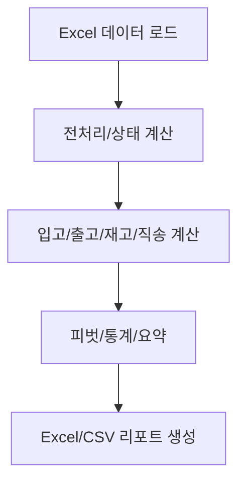

# HVDC Excel Reporter Final 전체 구조 분석 보고서 (2부)

---

## 클래스별 주요 메서드/속성 요약

### WarehouseIOCalculator
- **속성**
  - warehouse_columns: 창고 컬럼 리스트
  - site_columns: 현장 컬럼 리스트
  - warehouse_priority: 창고 우선순위
  - LOC_PRIORITY: 위치 우선순위(동일일자 타이브레이커)
  - flow_codes: Flow Code → 설명 매핑
  - combined_data: 통합 데이터프레임
  - total_records: 전체 데이터 건수

- **주요 메서드**
  - load_real_hvdc_data(): 실제 데이터 로드 및 통합
  - process_real_data(): 날짜 변환, Flow Code 재계산, total handling 컬럼 추가
  - calculate_warehouse_inbound(): 입고 계산 (PKG 수량 반영)
  - create_monthly_inbound_pivot(): 월별 입고 피벗 생성
  - calculate_final_location(): 우선순위 기반 최종 위치 계산
  - calculate_warehouse_outbound(): 출고 계산 (동일-일자 이동 지원)
  - calculate_warehouse_inventory(): 재고 계산 (Status_Location 기준)
  - calculate_direct_delivery(): Port→Site 직송 계산

### HVDCExcelReporterFinal
- **속성**
  - calculator: WarehouseIOCalculator 인스턴스
  - timestamp: 리포트 생성 시각

- **주요 메서드**
  - calculate_warehouse_statistics(): 4대 핵심 통계 + 피벗
  - create_warehouse_monthly_sheet(): 창고별 월별 입출고 시트
  - create_site_monthly_sheet(): 현장별 월별 입고/재고 시트
  - create_multi_level_headers(): Multi-Level Header 생성
  - create_flow_analysis_sheet(): Flow Code 분석 시트
  - create_transaction_summary_sheet(): 전체 트랜잭션 요약
  - generate_final_excel_report(): 9개 시트 Excel 리포트 생성

### StatusCalculator
- **속성**
  - site_cols: 현장 컬럼 리스트
  - warehouse_cols: 창고 컬럼 리스트
  - pre_arrival_cols: Pre Arrival 전용 컬럼 리스트

- **주요 메서드**
  - calculate_status_flags(): AS, AT 플래그 계산
  - calculate_status_current(): Status_Current(warehouse/site/Pre Arrival) 계산
  - calculate_status_location(): Status_Location(최종 위치) 계산
  - calculate_complete_status(): 위 3개 통합 적용

---

## 전체 데이터 흐름(파이프라인)

1. **데이터 로드**
   - HITACHI/SIEMENS Excel → 통합 DataFrame 생성
2. **전처리**
   - 날짜 컬럼 변환, Flow Code 재계산, total handling 컬럼 추가
3. **상태 계산**
   - StatusCalculator로 Status_Current, Status_Location 등 파생
4. **입고/출고/재고/직송 계산**
   - 입고: 위치 컬럼+PKG 수량
   - 출고: 다음 위치 이동(동일일자 포함)
   - 재고: Status_Location 기준 월말 누적
   - 직송: FLOW_CODE 0/1 + 현장 도착
5. **피벗/통계/요약**
   - 월별/창고별/현장별 피벗, KPI 검증, Flow Code 분석
6. **Excel/CSV 리포트 생성**
   - 9개 시트 Excel, 원본 CSV 백업

---

## 모듈 간 의존성/호출 관계

- **hvdc_excel_reporter_final.py**
  - WarehouseIOCalculator, StatusCalculator 사용
  - pandas, numpy, logging 등 표준 라이브러리 사용
- **warehouse_io_calculator.py**
  - StatusCalculator 사용 (상태 파생)
  - 입고/출고/재고/직송 계산
- **status_calculator.py**
  - 독립적 상태 계산 로직 제공
- **테스트/실행**
  - test_warehouse_io_calculator.py 등에서 각 클래스/함수 호출

---

## 실행 흐름(메인 함수/엔트리포인트)

- `if __name__ == "__main__":`
  - run_unit_tests() → 유닛테스트 28개 실행
  - 모든 테스트 통과 시 main() 실행
    - HVDCExcelReporterFinal 인스턴스 생성
    - 데이터 로드/전처리/상태 검증
    - Excel 리포트 생성 및 저장
    - 주요 결과/시트/통계 출력

---

## 에러 처리/로깅/Fail-safe 구조

- try/except로 데이터 로드, 리포트 생성 등 주요 단계 예외 처리
- logger.info/warning/error로 상세 실행 로그 기록
- KPI/Status_Location 등 검증 실패 시 경고 및 PASS/FAIL 반환
- PKG 수량/날짜 파싱 오류 등은 기본값/예외처리로 Fail-safe

---

## KPI 검증 로직 상세

- PKG Accuracy: 전체 Pkg 합/레코드수 ≥ 99%
- Status_Location 합계: 전체 재고와 일치해야 PASS
- Site Inventory Days: 주요 현장 재고 ≤ 30일
- 입고 ≥ 출고: 입고가 출고보다 많아야 PASS
- 모든 항목 PASS 시 KPI 검증 통과

---

## Flow Code/Status_Location/PKG 처리 예시

- Flow Code: 창고/현장 이동 경로에 따라 0~4 자동 계산
- Status_Location: 각 행별로 최종 위치(창고/현장/Pre Arrival) 자동 판별
- PKG: Pkg 컬럼 값이 없거나 0/빈값이면 1로 처리, 정수 변환 실패시 1

---

## 확장성/테스트 전략/유지보수성

- 창고/현장 추가 시 컬럼/우선순위만 수정하면 자동 반영
- 모든 핵심 함수/로직은 유닛테스트로 검증
- 구조적 변경(리팩토링)과 행위 변경(기능 추가) 분리
- 로직/상수/설정값은 클래스 속성/상수로 관리

---

## 실제 사용 예시/명령어

- python hvdc_excel_reporter_final.py
- /automate test-pipeline
- /logi_master analyze_inventory
- /switch_mode LATTICE
- /validate_data excel_reporter

---

## 주요 상수/설정/버전 관리

- PATCH_VERSION, PATCH_DATE, KPI_THRESHOLDS 등 상수로 관리
- 창고/현장/우선순위/Flow Code 등은 클래스 속성/상수로 선언
- 버전별 패치노트/핫픽스 주석으로 관리

---

## 전체 데이터 흐름 다이어그램 (예시)

--- 